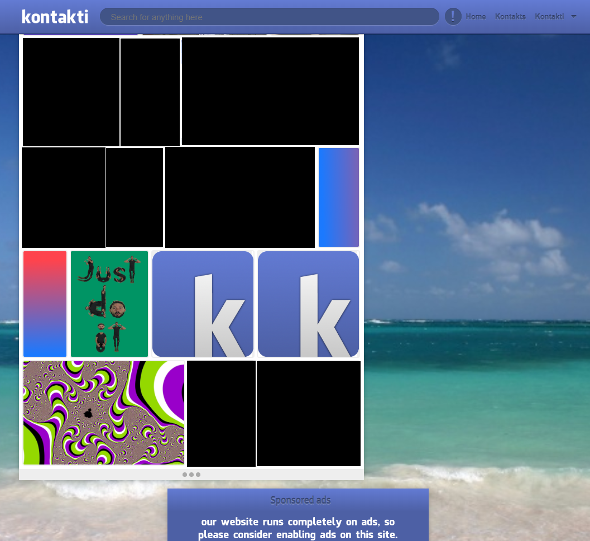
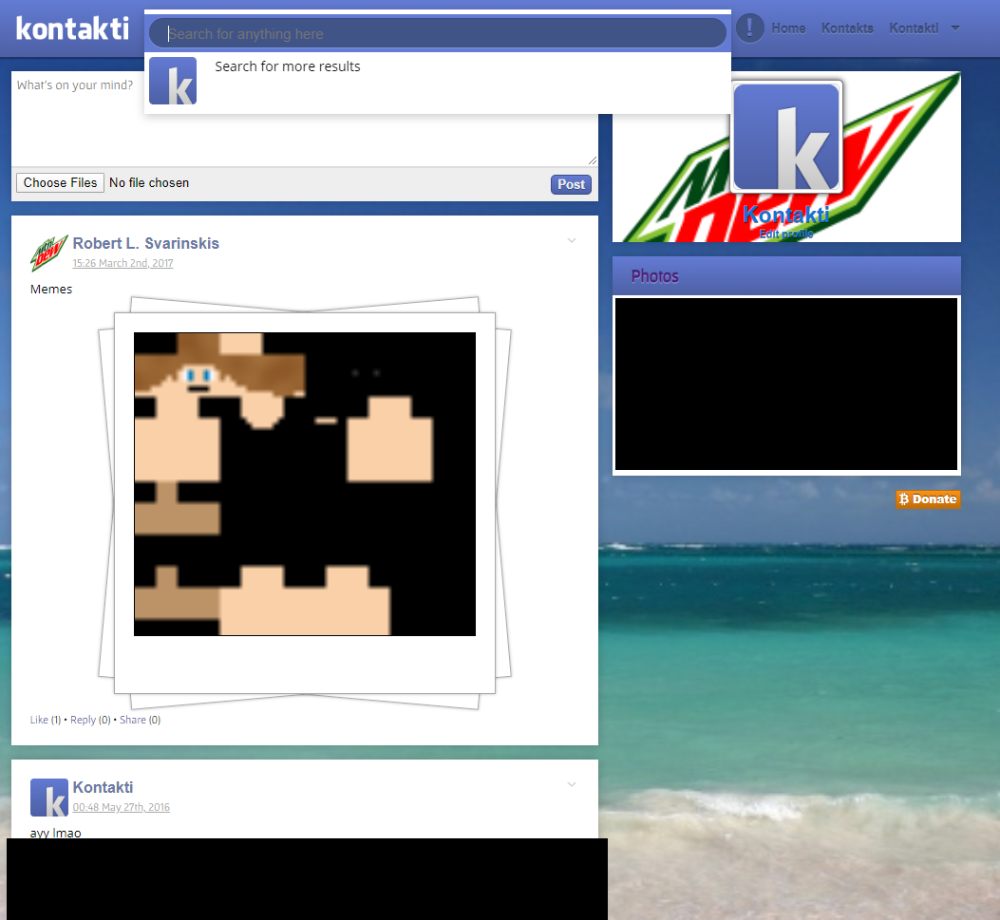
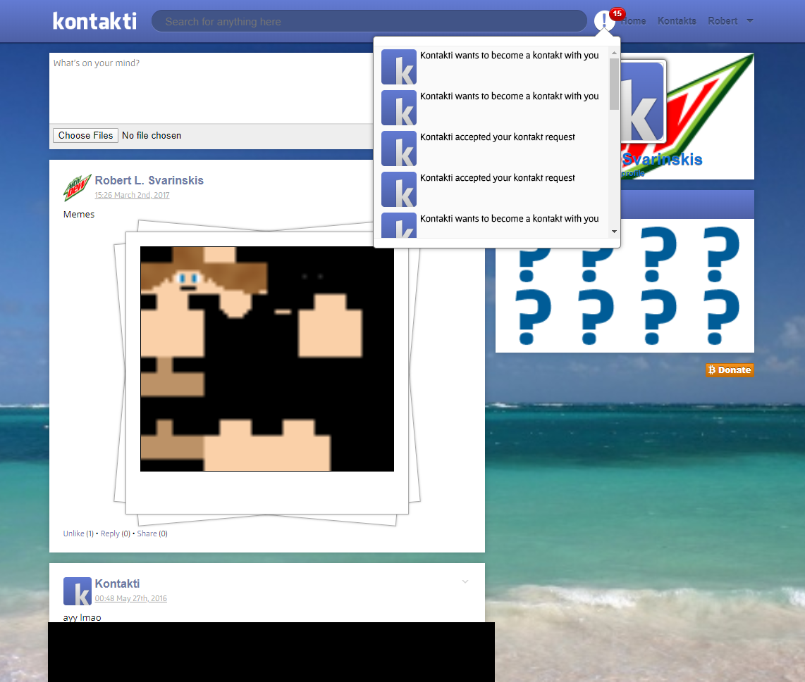
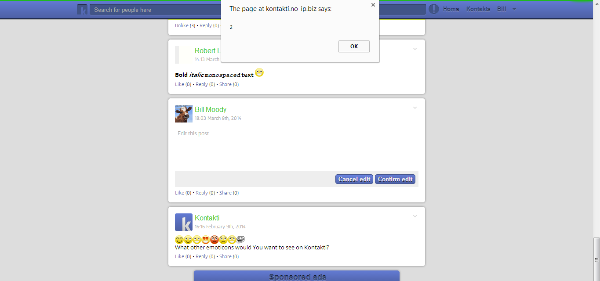

# Kontakti
A facebook clone I started making in 8th grade

# New screenshots

# Old screenshots

Oldest screenshot I could find. Mimicking old facebook design:

After experimenting with the design. Fearing competition, facebook too would soon follow with a redesign.

